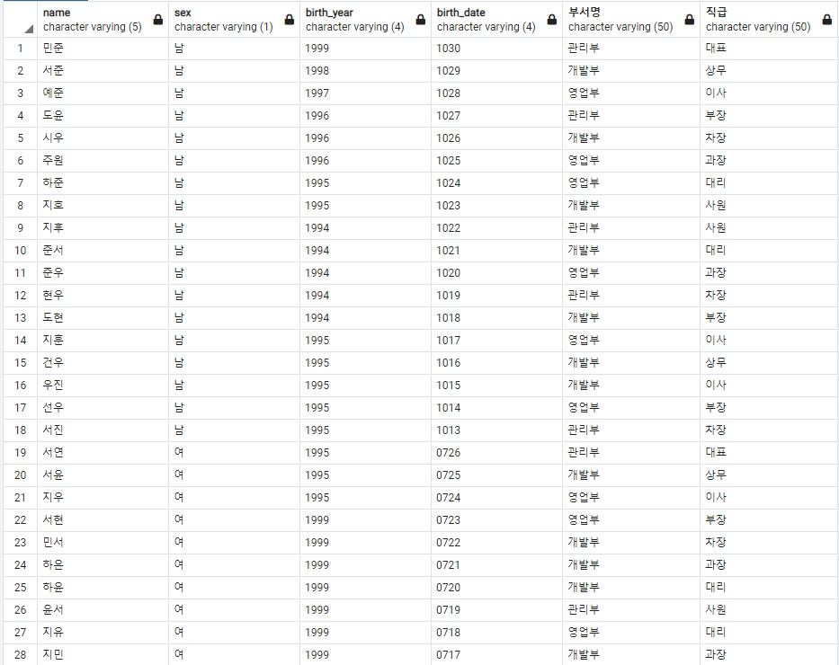
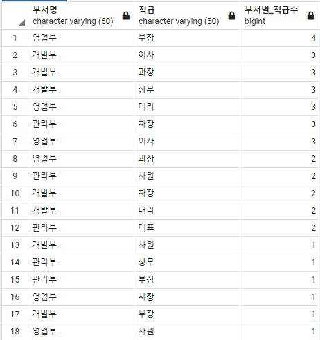
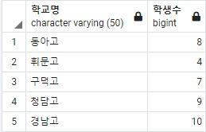
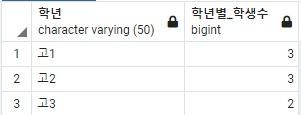
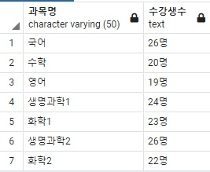
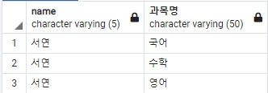

> # Q1. 사원명, 성별, 출생연도, 생일, 부서명, 직급 조회

## 사용 테이블 : study.person, study.common_code

 

### 결과

  

> # Q2. 부서명, 직급명, 부서별 직급수 조회

## 사용 테이블 : study.person, study.common_code

 

### 결과

  

----------------------------------------------------------------------------
----------------------------------------------------------------------------

  

> # Q3. 학교명, 학교별 학생수 조회

## 사용 테이블 study.student, study.common_code

 

### 결과

  

> # Q4. 동아고의 학년, 학년별 학생수 조회

## 사용 테이블 study.student, study.common_code

 

### 결과

  

> # Q5. 과목별 수강생수

## 사용 테이블 study.student, study.common_code

 

### 결과

  

> # Q6. 학생 '서연'이 수강하고 있는 과목명

## 사용 테이블 study.student, study.common_code

 

### 결과

  

